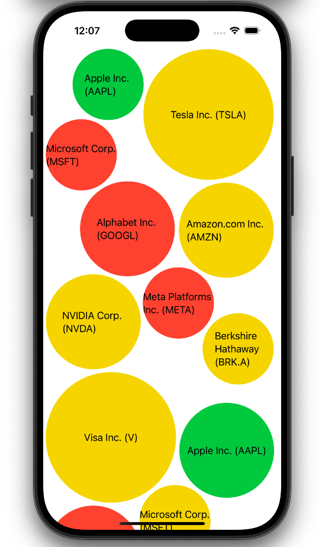

# BubblesLayout

Have you ever wanted to create a layout like this in SwiftUI?



With **BubblesLayout**, it's easy!

## Example Usage

### Quick Start

Import `BubblesLayout` and start with this simple example:

```
var body: some View {
    BubblesLayout(
        minSpacing: 8,
        bubbles: {
            ForEach(["A", "B", "C"], id: \.self) { title in
                Text(title)
                    .frame(width: 48, height: 48)
                    .background(.green)
                    .clipShape(Circle())
            }
        }
    )
}
```

### Example App

Run app in `Examples` folder.

## Remember

- You need to specify the size of each view you want to use as a bubble (e.g. by using [`.frame(width:height:alignment:)`](https://developer.apple.com/documentation/swiftui/view/frame(width:height:alignment:))).

## Limitations

- This solution uses `SpriteKit`’s gravity logic to calculate the approximate positions of the bubbles. As a result the solution is asynchronous and cannot utilize SwiftUI’s native `Layout` system. So `BubblesLayout` is a `View`, not a `Layout`.
- The touch areas of the bubbles may overlap, so keep that in mind.
- Currently, the bubbles can only be circles.

